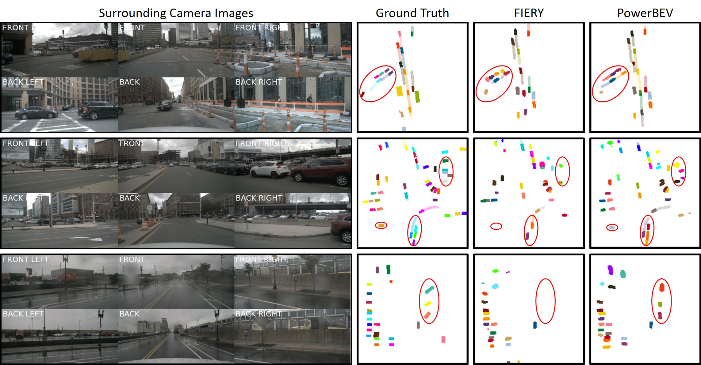

# PowerBEV
This is the official PyTorch implementation of the paper: 
> [**PowerBEV: A Powerful yet Lightweight Framework for Instance Prediction in Bird's-Eye View**](https://www.ijcai.org/proceedings/2023/0120.pdf)  
> [Peizheng Li](https://edwardleelpz.github.io/), [Shuxiao Ding](https://scholar.google.com/citations?user=QPLytlUAAAAJ&hl=en&oi=ao), [Xieyuanli Chen](https://xieyuanli-chen.com/), [Niklas Hanselmann](https://lasnik.github.io/), [Marius Cordts](https://scholar.google.com/citations?user=RM0ik8wAAAAJ&hl=en&oi=ao), [Jürgen Gall](https://scholar.google.com/citations?user=1CLaPMEAAAAJ&hl=en&oi=ao)



## 📃 Contents
- [PowerBEV](#powerbev)
  - [📃 Contents](#-contents)
  - [📰 News](#-news)
  - [⚙️ Setup](#️-setup)
  - [📁 Dataset](#-dataset)
  - [🔥 Pre-trained models](#-pre-trained-models)
  - [🏊 Training](#-training)
  - [🏄 Prediction](#-prediction)
    - [Evaluation](#evaluation)
    - [Visualisation](#visualisation)
  - [📜 License](#-license)
  - [🔗 Citation](#-citation)

## 📰 News
- PowerBEV has been accepted by [the 32nd International Joint Conference on Artificial Intelligence](https://ijcai-23.org/).
- PowerBEV has been included in [ROAD++: The Second Workshop & Challenge on Event Detection for Situation Awareness in Autonomous Driving](https://sites.google.com/view/road-plus-plus/home) @ [ICCV 2023](https://iccv2023.thecvf.com/).

## ⚙️ Setup
Create the [conda](https://docs.conda.io/en/latest/miniconda.html) environment by running 
```
conda env create -f environment.yml
```

## 📁 Dataset
- Download the full [*NuScenes dataset (v1.0)*](https://www.nuscenes.org/download), which includes the *Mini dataset* (metadata and sensor file blobs) and the *Trainval dataset* (metadata and file blobs part 1-10).
- Extract the tar files to the default `nuscenes/` or to `YOUR_NUSCENES_DATAROOT`. The files should be organized in the following structure:
  ```
  nuscenes/
  ├──── trainval/
  │     ├──── maps/
  │     ├──── samples/
  │     ├──── sweeps/
  │     └──── v1.0-trainval/
  └──── mini/
        ├──── maps/
        ├──── samples/
        ├──── sweeps/
        └──── v1.0-mini/
  ```

## 🔥 Pre-trained models
The config file can be found in [`powerbev/configs`](powerbev/configs)  

| Config | Weights | Dataset | Past Context | Future Horizon | BEV Size | IoU | VPQ |
|-|-|-|:-:|:-:|-|:-:|:-:|
| [`powerbev.yml`](powerbev/configs/powerbev.yml) | [`PowerBEV_long.ckpt`](https://drive.google.com/file/d/1P33nD6nt8IjnvKTd4WlTKWbarFdCE34f/view?usp=sharing) | NuScenes| 1.0s | 2.0s | 100m x 100m (50cm res.) | 39.3 | 33.8 |
| [`powerbev.yml`](powerbev/configs/powerbev.yml) | [`PowerBEV_short.ckpt`](https://drive.google.com/file/d/1-T4R6vC2HHhqxXeUeUg-CuViA5XdQEcV/view?usp=sharing) | NuScenes| 1.0s | 2.0s | 30m x 30m (15cm res.) | 62.5 | 55.5 |  

Note: All metrics above are obtained by training based on pre-trained static weights ([`static long`](https://drive.google.com/file/d/16bnG3kI_J3JkFGGxMuQfz879QFz7SVhj/view?usp=sharing)/[`static short`](https://drive.google.com/file/d/1Jwb2UjNEuamwNmBZ_R-DAW91dhxi4_6J/view?usp=sharing)).

## 🏊 Training
To train the model from scratch on NuScenes, run

```
python train.py --config powerbev/configs/powerbev.yml
```

To train the model from the pre-trained static checkpoint on NuScenes, download pre-trained static weights ([`static long`](https://drive.google.com/file/d/16bnG3kI_J3JkFGGxMuQfz879QFz7SVhj/view?usp=sharing)/[`static short`](https://drive.google.com/file/d/1Jwb2UjNEuamwNmBZ_R-DAW91dhxi4_6J/view?usp=sharing)) to `YOUR_PRETRAINED_STATIC_WEIGHTS_PATH` and run

```
python train.py --config powerbev/configs/powerbev.yml \
                PRETRAINED.LOAD_WEIGHTS True \
                PRETRAINED.PATH $YOUR_PRETRAINED_STATIC_WEIGHTS_PATH
```

Note: These will train the model on 4 GPUs, each with a batch of size 2. 

To set your configs, please run

```
python train.py --config powerbev/configs/powerbev.yml \
                DATASET.DATAROOT $YOUR_NUSCENES_DATAROOT \
                LOG_DIR $YOUR_OUTPUT_PATH \
                GPUS [0] \
                BATCHSIZE $YOUR_DESIRED_BATCHSIZE
```

The above settings can also be changed directly by modifying [`powerbev.yml`](powerbev/configs/powerbev.yml). Please see the [`config.py`](powerbev/config.py) for more information.  

## 🏄 Prediction
### Evaluation
Download trained weights ([`long`](https://drive.google.com/file/d/1P33nD6nt8IjnvKTd4WlTKWbarFdCE34f/view?usp=sharing)/[`short`](https://drive.google.com/file/d/1-T4R6vC2HHhqxXeUeUg-CuViA5XdQEcV/view?usp=sharing)) to `YOUR_PRETRAINED_WEIGHTS_PATH` and run
```
python test.py --config powerbev/configs/powerbev.yml \
                PRETRAINED.LOAD_WEIGHTS True \
                PRETRAINED.PATH $YOUR_PRETRAINED_WEIGHTS_PATH
```

### Visualisation
Download trained weights ([`long`](https://drive.google.com/file/d/1P33nD6nt8IjnvKTd4WlTKWbarFdCE34f/view?usp=sharing)/[`short`](https://drive.google.com/file/d/1-T4R6vC2HHhqxXeUeUg-CuViA5XdQEcV/view?usp=sharing)) to `YOUR_PRETRAINED_WEIGHTS_PATH` and run
```
python visualise.py --config powerbev/configs/powerbev.yml \
                PRETRAINED.LOAD_WEIGHTS True \
                PRETRAINED.PATH $YOUR_PRETRAINED_WEIGHTS_PATH \
                BATCHSIZE 1
```
This will render predictions from the network and save them to an `visualization_outputs` folder.
Note: To visualize Ground Truth, please add the config `VISUALIZATION.VIS_GT True` at the end of the command

## 📜 License
PowerBEV is released under the MIT license. Please see the [LICENSE](LICENSE) file for more information.

## 🔗 Citation
```
@article{li2023powerbev,
  title     = {PowerBEV: A Powerful Yet Lightweight Framework for Instance Prediction in Bird's-Eye View},
  author    = {Li, Peizheng and Ding, Shuxiao and Chen, Xieyuanli and Hanselmann, Niklas and Cordts, Marius and Gall, Juergen},
  journal   = {arXiv preprint arXiv:2306.10761},
  year      = {2023}
}
@inproceedings{ijcai2023p120,
  title     = {PowerBEV: A Powerful Yet Lightweight Framework for Instance Prediction in Bird’s-Eye View},
  author    = {Li, Peizheng and Ding, Shuxiao and Chen, Xieyuanli and Hanselmann, Niklas and Cordts, Marius and Gall, Juergen},
  booktitle = {Proceedings of the Thirty-Second International Joint Conference on
               Artificial Intelligence, {IJCAI-23}},
  publisher = {International Joint Conferences on Artificial Intelligence Organization},
  editor    = {Edith Elkind},
  pages     = {1080--1088},
  year      = {2023},
  month     = {8},
  note      = {Main Track},
  doi       = {10.24963/ijcai.2023/120},
  url       = {https://doi.org/10.24963/ijcai.2023/120},
}
```